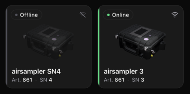
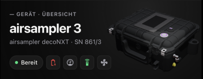
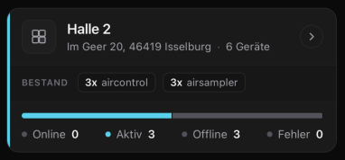
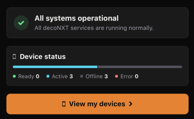
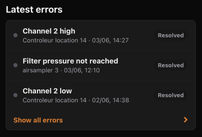
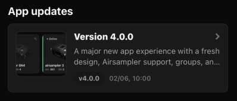

# What's New in 4.0.0

Version 4.0.0 is one of our biggest updates yet. The app has been fundamentally redesigned and introduces four key improvements for everyday use: a modern design, full airsampler support, powerful group functionality, and a significantly more useful home screen.

See what's important faster, control devices with fewer steps, and manage larger workflows directly within the app.

- Complete redesign with updated screens, cards, buttons, colors, icons, and typography.
- Full airsampler decoNXT integration with dashboard, live values, remote control, parameters, scheduler, and reports.
- New groups for organizing multiple devices and performing bulk actions.
- Redesigned home screen with system status, device status, recent errors, and app updates.

## Complete Redesign

The app is now cleaner, more focused, and easier to use. Status information, actions, and detail views are clearly separated, allowing important information to be identified more quickly and tasks to be completed more efficiently.

### Improvements

- Dashboards, settings, reports, and lists now use a consistent layout.
- Cards, buttons, status colors, icons, and typography have been redesigned throughout the app.

## airsampler Integration

Version 4.0.0 introduces full support for the airsampler decoNXT. airsampler devices are automatically detected and receive a dedicated user experience.

The airsampler dashboard provides:

- Device name, article number, serial number, product image, and current status.
- Ready, Active, Offline, and Error states.
- Battery, charging, power, measurement, remote control, fan, and error indicators.
- Direct access to overview, location, parameters, and settings.
- Live values for flow rate, filter pressure, total volume, and pump performance.
- Environmental values including temperature, humidity, and air pressure.
- Current operating mode with progress information for total volume, runtime, or scheduler operation.
- Information about when the next measurement values are expected.

You can control and configure the airsampler directly:

- Start measurements immediately or at a configured start time.
- Stop active measurements with confirmation.
- Configure operating mode, target volume, target runtime, start time, flow rate, pressure limits, and ventilation.
- Schedule recurring measurements using active weekdays and up to three time windows.

airsampler measurements are fully integrated into the reporting workflow. Open a measurement to add or update report information such as title, sample description, responsible personnel, or location.

## Group Integration

Groups allow multiple devices to be organized and managed centrally. Create groups for rooms, projects, customer sites, production areas, or measurement campaigns and manage everything from a dedicated group dashboard.

When creating a group, the app guides you through:

- Group details including name, description, location, project ID, and responsible person.
- Device selection with search and filters for aircontrol and airsampler devices.

Within a group you can view:

- Group information such as location, project, and responsible person.
- A status summary for online, active, offline, and error devices.
- Device cards displaying name, article number, serial number, operating mode, current status, and available measurement values.

Group actions help streamline daily operations:

- Start selected compatible devices.
- Stop active compatible devices.
- Configure multiple compatible online devices simultaneously.

## Redesigned Home Screen

The home screen now serves as the central hub for important information and actions within the app. Instead of only displaying news, it provides the most relevant information immediately after opening decoNXT.

On the home screen you can:

- Check the decoNXT system status, including operational status, maintenance activities, incidents, and affected services.
- View a compact summary of your devices.
- Review the latest device errors, including status, affected device, and timestamp.
- Read release notes for app updates.

